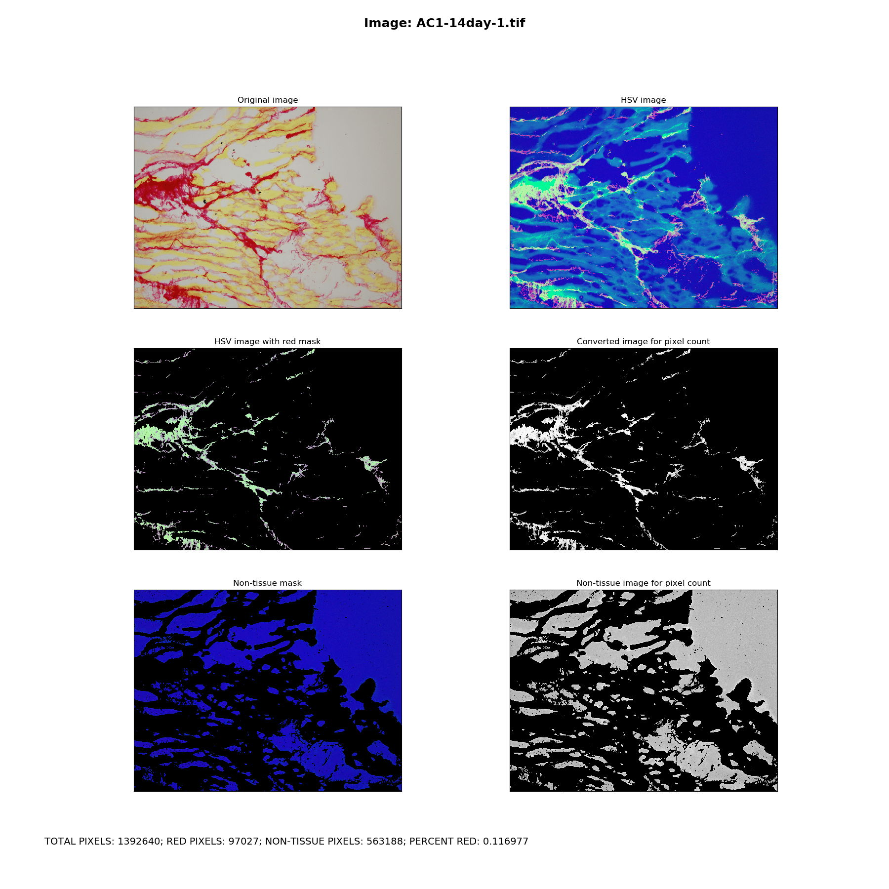
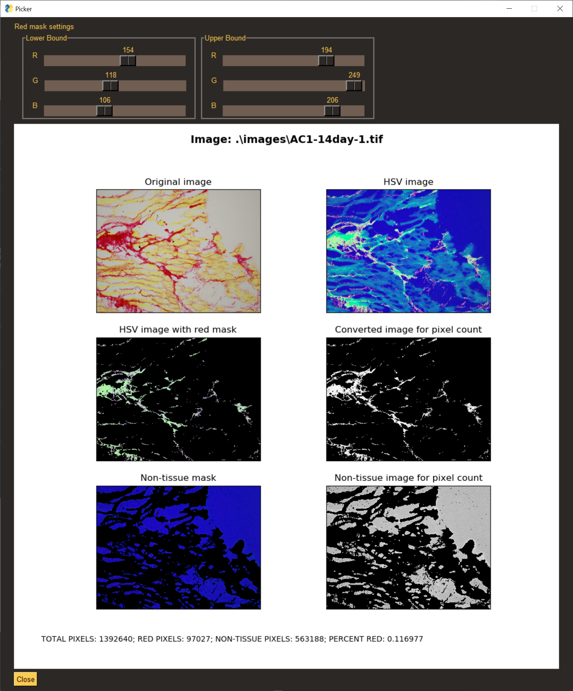

## Picrosirius Red Stain Tissue Image quantification

### Overview

These python files can be used to automate quantification for images of tissue stained with picrosirius red staining using python and openCV. The end result of this program (convert.py) is to produce a percentage of pixels in an image that are attributed to the red stain from the PSR process.

An additional GUI utility (color-picker.py) is included to help determine the upper and lower bounds of red pixels to be used in the program. Note that this presently only selects the upper and lower bounds for the red mask; the white mask (used to determine the background/non-tissue pixels) has preset upper and lower bounds, but can be easily added in (please file an issue in this repository if you're interested).

### Setup

To use this program, you must have python 3.x installed on your system, which can be downloaded from https://www.python.org/

Clone or download this repository. Open a command prompt at the root directory of the folder and run the following command:

```
pip install -r requirements.txt
```

This will install all required packages to run the analyzer and the color picker.

### Running the analyzer

Once the package requirements are installed, you can run the analyzer as follows:

```
python convert.py -p "./path/to/your/images/folder"
```
Note that you can change the file extension for images to another type by adding an additional parameter to the command:
```
python convert.py -p "./path/to/your/images/folder" -e ".png"
```

Results will be saved in the images folder under a new folder for each image analyzed (the folder name will be the same as the image file name). For each image analyzed, a summary plot is generated in `*.tif` format with the summary information at the bottom. The resulting pixel information is saved to a `PSR_results.csv` file in the supplied image directory.

Sample:

All six images displayed in the plot are additionally saved to the specific image folder for closer inspection. Note that re-running this program will overwrite previous results.

### How the analyzer works

Running the analyzer will perform the following steps:

1. Reads all image files (set to `*.tif`, but can be changed) file names in the supplied directory (non-recursive)
2. Loops over each image and:
   - creates a mask to capture a range of red pixels
   - applies the mask to the image and counts the number of non-black pixels (the red tinted pixels in the original image)
   - creates an additional mask to capture the background/non-tissue (white) pixels
   - applies the mask to the image and counts the number of non-black pixels (the background/white tinted pixels in the original image)
   - computes the percentage of red-stained area as the `red pixels / (total pixels - background pixels)
   - saves a plot of the images used in the process and the individual images to a folder with the same name as the input image
3. Saves the results of each image to a csv file for further analysis.

### Picking new upper and lower bounds for red detection

An additional, very basic utility (color_picker.py) is provided to allow for picking new upper and lower thresholds for red stain detection. The lower and upper bounds are the minimum and maximum pixel values, respectively, to use when creating the mask that filters for red pixels.

You can run the color picker as follows:

```
python color_picker.py -i "./path/to/image.tif"
```



You can adjust the sliders at the top of the window to change the range of detected pixels for the red mask. To use these values in the analyzer, copy the R,G,B values in the red mask settings into the `red`
entry for `HSV_RANGES` in analyzer.py. For example, the defaults for the picker (shown above) are:

```
Lower
R: 154
G: 118
B: 106

Upper:
R: 194
G: 249
B: 206
```

Those numbers should be copied into the analyzer.py file on line 26 as shown below:

```
'red': [
        {
            'lower': np.array([154, 118, 106]),
            'upper': np.array([194, 249, 206])
        },
    ],
```
